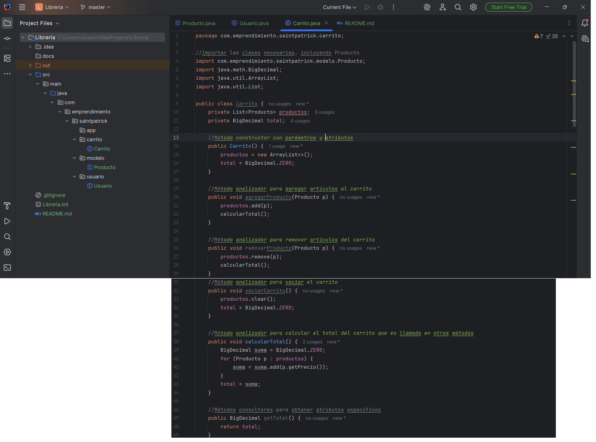
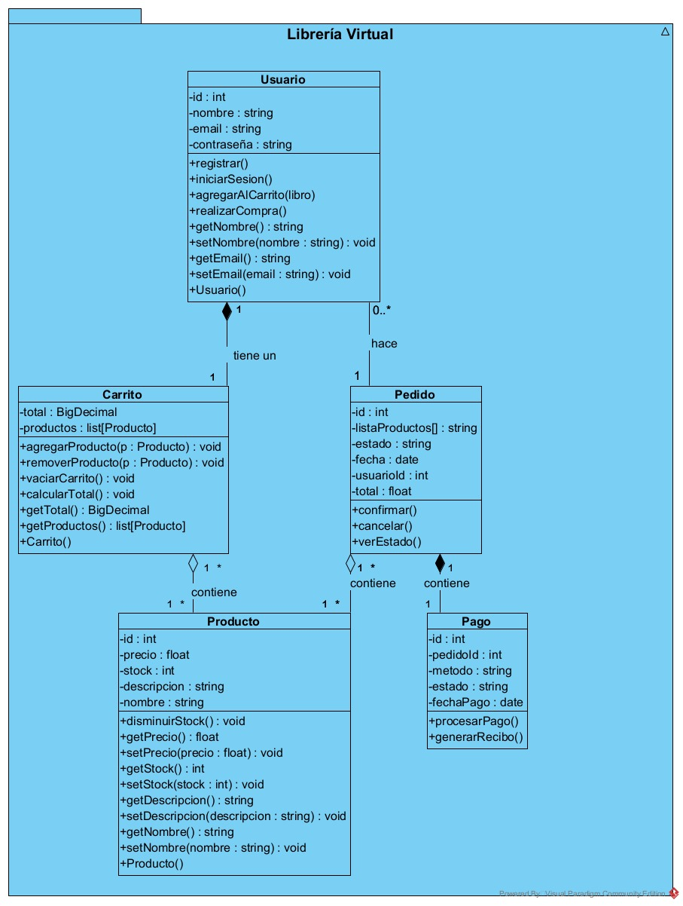
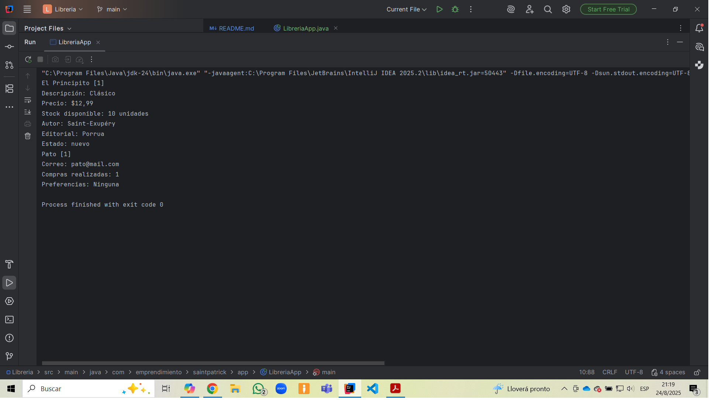
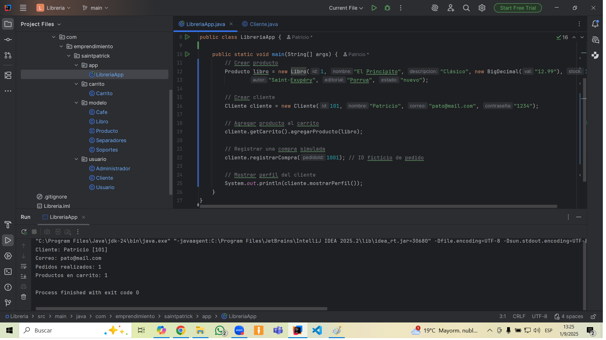

# Librería Virtual

## Descripción del Proyecto
Plataforma e-Commerce desarrollada en Java para la venta de libros físicos, café artesanal, tazas, soportes y separadores de página.
El sistema simula el funcionamiento de una librería moderna, con gestión de usuarios, carrito de compras, inventario y lógica de negocio orientada a objetos.

## Tecnologías Utilizadas
- Java 24
- IDE: IntelliJ IDEA
- Control de versiones: Git + GitHub

## Implementación

1. **Paquetes:**
- modelo: Contiene la clase abstracta Producto y sus subclases (Libro, Cafe, Separadores, Soportes). Aquí se implementa la lógica de inventario, herencia y polimorfismo.
- usuario: Define la clase base Usuario y sus derivadas Cliente y Administrador, con métodos sobrescritos como mostrarPerfil().
- carrito: Maneja la clase Carrito, con métodos sobrecargados para agregar productos por objeto, ID o datos sueltos.
- app: Contiene el punto de entrada (main) y pruebas en consola para validar el comportamiento del sistema.
2. **Constructores y getters/setters:** en todas las clases, con encapsulamiento selectivo para proteger la integridad de los objetos.
3. **Métodos analíticos:** para agregar, remover y vaciar productos del carrito, además de calcular el total dinámico.
4. **Herencia y especialización:**
- Producto → Libro, Cafe, Separadores, Soportes
- Usuario → Cliente, Administrador

5. **Polimorfismo:**
  Se implementa el método mostrarDetalle() en Producto como abstracto, y se sobrescribe en cada subclase para mostrar información específica.
  También se aplica en Usuario mediante mostrarPerfil(), sobrescrito en Cliente y Administrador.
6. **Sobrecarga de métodos:**
  En Carrito, el método agregarProducto() se sobrecarga para aceptar:
- Un objeto Producto
- Un id y un catálogo simulado
- Un nombre y precio para crear un producto temporal
7. **Sobrescritura:**
  Métodos como mostrarDetalle() y mostrarPerfil() se sobrescriben para personalizar la salida según el tipo de objeto.

## Desafíos y Resoluciones
- **Gestión de stock:** Se implementaron incrementarStock(int) y disminuirStock(int) en Producto, incluyendo validaciones y excepciones. También se creó una versión sobrecargada de disminuirStock() para reducir una sola unidad.
- **Importaciones innecesarias:** Se depuraron los paquetes eliminando clases importadas sin uso.
- **Encapsulamiento:** Se aplica el uso de getters sin setters en las sub clases para proteger la integridad del objeto.
- **Diseño orientado a objetos:** Se añadió el atributo carrito a la clase Cliente, permitiendo simular compras, calcular totales y mostrar productos en el perfil.

## Capturas de pantalla
  

---
