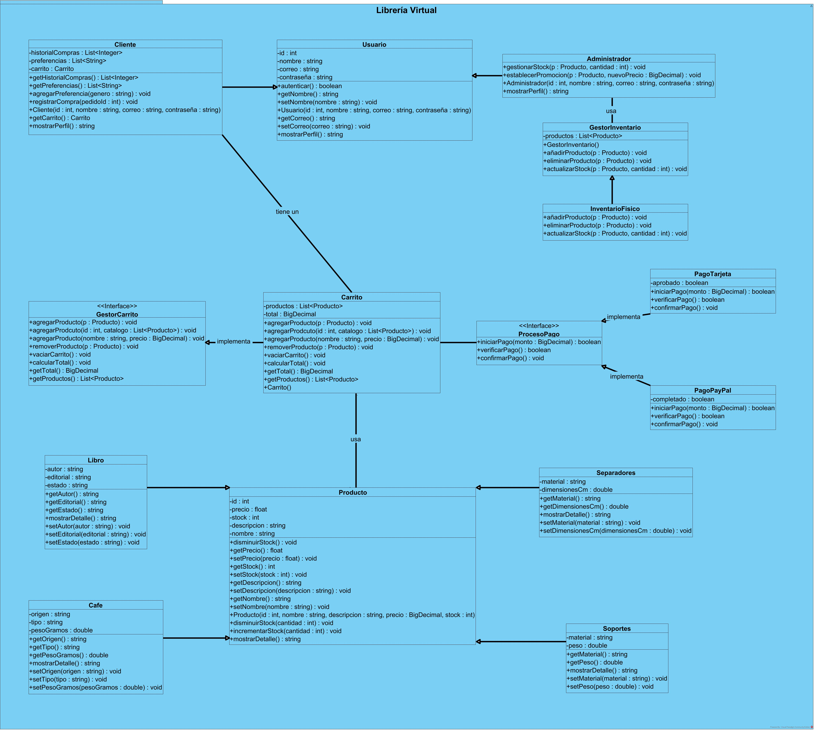
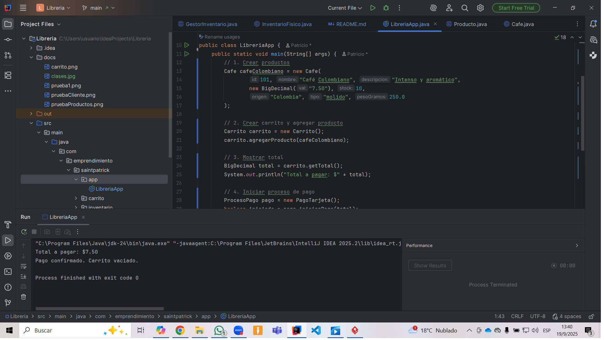
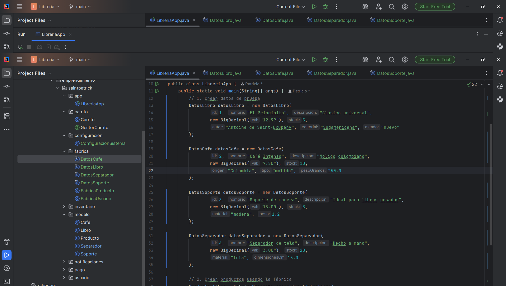
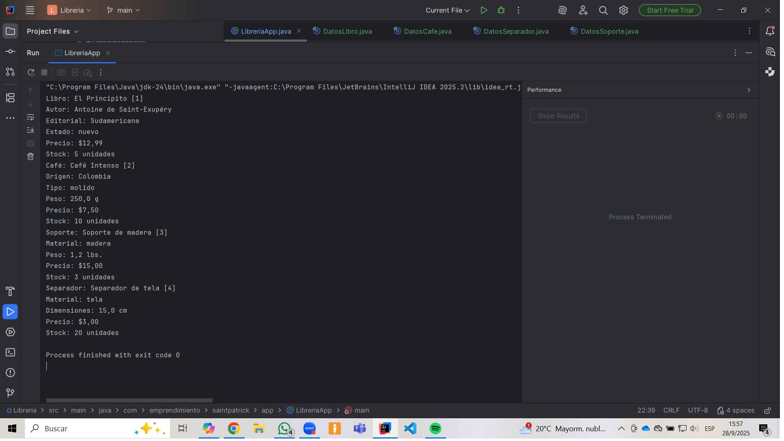
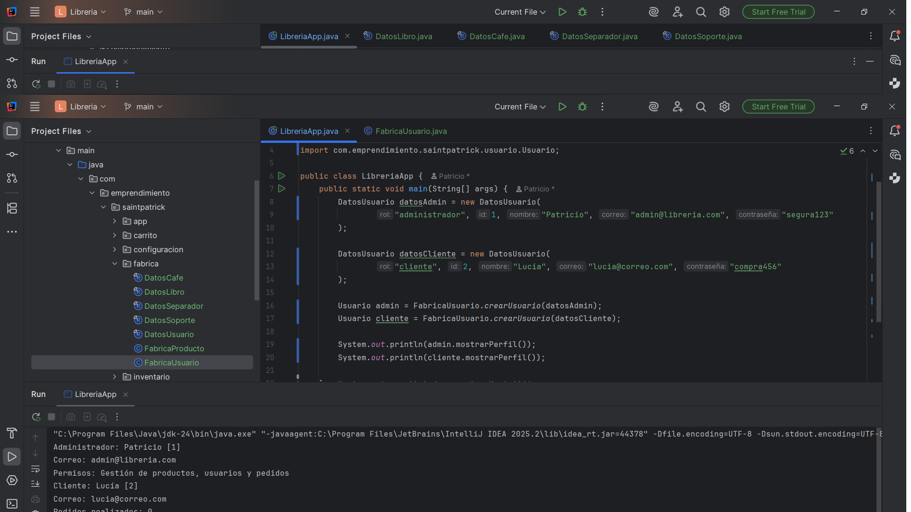

# Librería Virtual

## Descripción del Proyecto
Plataforma e-Commerce desarrollada en Java para la venta de libros físicos, café artesanal, soportes y separadores de página.
El sistema simula el funcionamiento de una librería moderna, con gestión de usuarios, carrito de compras, inventario, procesos de pago y lógica de negocio orientada a objetos

## Tecnologías Utilizadas
- Java 24
- IDE: IntelliJ IDEA
- Control de versiones: Git + GitHub

## Implementación

1. 📦 Estructura de Paquetes
- **modelo:**
  Contiene la clase abstracta Producto y sus subclases (Libro, Cafe, Separadores, Soportes). Aquí se implementa la lógica de herencia, polimorfismo y validaciones específicas por tipo de producto.
- **usuario:**
  Define la clase abstracta Usuario y sus derivadas Cliente y Administrador, con métodos sobrescritos como mostrarPerfil() y validaciones específicas.
- **carrito:**
  Contiene la interfaz GestorCarrito y la clase Carrito, que implementa métodos sobrecargados para agregar productos por objeto, ID o datos sueltos. Calcula el total y permite vaciar o consultar el carrito.
- **inventario:**
  Incluye la clase abstracta GestorInventario y su implementación GestorInventarioFisico, encargada de añadir, eliminar y actualizar productos en el catálogo físico.
- **pago:**
  Define la interfaz ProcesoPago y sus implementaciones PagoTarjeta y PagoPayPal, simulando el flujo de validación, verificación y confirmación de pagos.
- **pedidos:**
  Define la clase GestorPedidos, la cual interactúa con Carrito y proporciona la funcionalidad de realizar pedidos en la plataforma ecommerce. También se incluye Pedido con todos sus atributos y únicamente getters en este caso, ya que se espera que los atributos de esta clase se mantengan invariables.
- **app:**
  Contiene el punto de entrada (main) y pruebas en consola para validar el comportamiento del sistema.

2. 🔐 Encapsulamiento en Clases Principales
- Todos los atributos fueron declarados como private.
- Se implementaron getters y setters públicos según necesidad.
- Se añadieron validaciones en los setters para proteger la integridad del sistema:
- Validación de formato de correo electrónico en Usuario.
- Validación de precios positivos y stock no negativo en Producto.
- Validación de precios en productos temporales en Carrito.

3. 🔐 Encapsulamiento en Subclases de Usuario
- Cliente y Administrador aplican encapsulamiento estricto.
- Validaciones específicas:
- Cliente: preferencias no vacías, IDs de pedidos positivos.
- Administrador: productos no nulos, cantidades distintas de cero, precios válidos.

4. 🔐 Encapsulamiento en Subclases de Producto
- Validaciones por tipo:
- Campos de texto no vacíos (autor, material, tipo, etc.).
- Atributos restringidos a valores específicos (estado, tipo de café, material).
- Valores numéricos como peso y dimensiones deben ser positivos.

5. 🧩 Abstracción e Interfaces
- Clase abstracta GestorInventario:
  Define métodos como añadirProducto(), eliminarProducto() y actualizarStock().
  Actualmente se implementa InventarioFisico, dejando abierta la posibilidad de inventarios digitales o promocionales.
- Interfaz ProcesoPago:
  Define el contrato para iniciar, verificar y confirmar pagos.
  Las clases PagoTarjeta y PagoPayPal simulan el flujo de pago con validaciones internas.
- Interfaz GestorCarrito:
  Define las operaciones del carrito de compras.
  La clase Carrito implementa esta interfaz, separando la lógica de compra del inventario general.

6. 🧠 Patrones de Diseño Implementados
- Factory Method (Fábrica):
  Las clases FabricaProducto y FabricaUsuario encapsulan la lógica de creación de objetos complejos (Libro, Cafe, Cliente, Administrador) a partir de estructuras de datos (DatosLibro, DatosUsuario, etc.).
  Se validan atributos antes de instanciar, garantizando integridad y extensibilidad.
- Observer (Observador):
  El sistema de notificaciones (GestorEventos, NotificadorEmail, NotificadorUI, etc.) aplica el patrón Observer.
  Los observadores se registran en un Sujeto y reaccionan automáticamente ante eventos como confirmación de pedido o actualización de stock
- Singleton (Instancia Única):
  ConfiguracionSistema se implementa como Singleton para garantizar una única instancia de configuración compartida en todo el sistema

⚙️ Desafíos y Resoluciones
- Gestión de stock:
  Se implementaron incrementarStock(int) y disminuirStock(int) en Producto, con validaciones y excepciones.
  Se añadió una versión sobrecargada para disminuir una sola unidad.
- Depuración de importaciones:
  Se eliminaron clases importadas sin uso para optimizar los paquetes.
- Encapsulamiento reforzado:
  Se aplicó el uso de getters sin setters en subclases para proteger la integridad del objeto.
- Diseño orientado a objetos:
  Se añadió el atributo carrito a la clase Cliente, permitiendo simular compras, calcular totales y mostrar productos en el perfil.
- Interfaces:
Se implementaron interfaces como GestorCarrito y ProcesoPago para encapsular los métodos a clases concretas y reducir el acoplamiento.
- Visibilidad:
Se optó por cambiar la visibilidad del atributo de la clase abstracta GestorInventario para que pueda ser manipulado por sus subclases.
- Archivos para fabricar productos y usuarios: Se crearon archivos que contienen atributos de las subclases del modelo de negocio para aislar la lógica de negocio y fabricar productos y usuarios con validación previa.

## Capturas de pantalla
  

---
