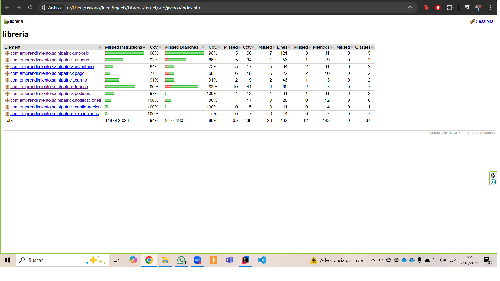

# Librería Virtual

## Descripción del Proyecto
Plataforma e-Commerce desarrollada en Java para la venta de libros físicos, café artesanal, soportes y separadores de página.
El sistema simula el funcionamiento de una librería moderna, con gestión de usuarios, carrito de compras, inventario, procesos de pago y lógica de negocio orientada a objetos

## Tecnologías Utilizadas
- Java 24
- IDE: IntelliJ IDEA
- Control de versiones: Git + GitHub

## Implementación

###    1. 📦 Estructura de Paquetes
- **modelo:**
  Contiene la clase abstracta Producto y sus subclases (Libro, Cafe, Separadores, Soportes). Aquí se implementa la lógica de herencia, polimorfismo y validaciones específicas por tipo de producto.
- **usuario:**
  Define la clase abstracta Usuario y sus derivadas Cliente y Administrador, con métodos sobrescritos como mostrarPerfil() y validaciones específicas.
- **carrito:**
  Contiene la interfaz GestorCarrito y la clase Carrito, que implementa métodos sobrecargados para agregar productos por objeto, ID o datos sueltos. Calcula el total y permite vaciar o consultar el carrito.
- **inventario:**
  Incluye la clase abstracta GestorInventario y su implementación GestorInventarioFisico, encargada de añadir, eliminar y actualizar productos en el catálogo físico.
- **pago:**
  Define la interfaz ProcesoPago y sus implementaciones PagoTarjeta y PagoPayPal, simulando el flujo de validación, verificación y confirmación de pagos.
- **pedidos:**
  Define la clase GestorPedidos, la cual interactúa con Carrito y proporciona la funcionalidad de realizar pedidos en la plataforma ecommerce. También se incluye Pedido con todos sus atributos y únicamente getters en este caso, ya que se espera que los atributos de esta clase se mantengan invariables.
- **app:**
  Contiene el punto de entrada (main) y pruebas en consola para validar el comportamiento del sistema.

###    2. 🔐 Encapsulamiento en Clases Principales
- Todos los atributos fueron declarados como private.
- Se implementaron getters y setters públicos según necesidad.
- Se añadieron validaciones en los setters para proteger la integridad del sistema:
- Validación de formato de correo electrónico en Usuario.
- Validación de precios positivos y stock no negativo en Producto.
- Validación de precios en productos temporales en Carrito.

###  3. 🔐 Encapsulamiento en Subclases de Usuario
- Cliente y Administrador aplican encapsulamiento estricto.
- Validaciones específicas:
- Cliente: preferencias no vacías, IDs de pedidos positivos.
- Administrador: productos no nulos, cantidades distintas de cero, precios válidos.

###  4. 🔐 Encapsulamiento en Subclases de Producto
- Validaciones por tipo:
- Campos de texto no vacíos (autor, material, tipo, etc.).
- Atributos restringidos a valores específicos (estado, tipo de café, material).
- Valores numéricos como peso y dimensiones deben ser positivos.

###  5. 🧩 Abstracción e Interfaces
- Clase abstracta GestorInventario:
  Define métodos como añadirProducto(), eliminarProducto() y actualizarStock().
  Actualmente se implementa InventarioFisico, dejando abierta la posibilidad de inventarios digitales o promocionales.
- Interfaz ProcesoPago:
  Define el contrato para iniciar, verificar y confirmar pagos.
  Las clases PagoTarjeta y PagoPayPal simulan el flujo de pago con validaciones internas.
- Interfaz GestorCarrito:
  Define las operaciones del carrito de compras.
  La clase Carrito implementa esta interfaz, separando la lógica de compra del inventario general.

###  6. 🧠 Patrones de Diseño Implementados
- Factory Method (Fábrica):
  Las clases FabricaProducto y FabricaUsuario encapsulan la lógica de creación de objetos complejos (Libro, Cafe, Cliente, Administrador) a partir de estructuras de datos (DatosLibro, DatosUsuario, etc.).
  Se validan atributos antes de instanciar, garantizando integridad y extensibilidad.
- Observer (Observador):
  El sistema de notificaciones (GestorEventos, NotificadorEmail, NotificadorUI, etc.) aplica el patrón Observer.
  Los observadores se registran en un Sujeto y reaccionan automáticamente ante eventos como confirmación de pedido o actualización de stock
- Singleton (Instancia Única):
  ConfiguracionSistema se implementa como Singleton para garantizar una única instancia de configuración compartida en todo el sistema

###  7. 🧨 Manejo de excepciones

Se implementaron validaciones defensivas en todas las clases del modelo. Las pruebas unitarias cubren tanto los casos válidos como los escenarios que deben lanzar excepciones específicas:

- Validaciones en Producto:
  - IllegalArgumentException si el precio es nulo o ≤ 0
  - InventarioInsuficiente si se intenta disminuir más stock del disponible
  - IllegalStateException si se intenta disminuir stock cuando es 0
- Validaciones en Usuario:
  - DatosInvalidos si el nombre es nulo o vacío
  - CorreoInvalido si el correo no cumple el formato
  - UsuarioNoAutenticado si las credenciales no coinciden
- Validaciones en subclases de Producto:
  - IllegalArgumentException si el tipo, estado, material o dimensiones son inválidos
- Validaciones en Administrador:
  - IllegalArgumentException si el producto es nulo, la cantidad es cero o el precio es inválido
- Validaciones en Cliente:
  - IllegalArgumentException si se intenta registrar una compra nula o agregar una preferencia vacía
- Validaciones en Carrito:
  - IllegalArgumentException si se intenta agregar un producto con precio ≤ 0
- Validaciones en FabricaProducto:
  - IllegalArgumentException si los datos no cumplen con los valores esperado

###    8. 🧪 Pruebas Unitarias y Cobertura

🔍 Cobertura alcanzada
- Cobertura de instrucciones: 94%
- Cobertura de ramas: 86%

🧪 Estrategia de pruebas

- Se cubrieron todas las ramas condicionales (if, switch, validaciones)
- Se probaron todos los métodos públicos, incluyendo toString(), mostrarDetalle(), mostrarPerfil()
- Se simularon flujos completos como confirmación de pedido, gestión de stock, fabricación de productos y usuarios
- Se validó el patrón Singleton en ConfiguracionSistema y el patrón Observer en GestorEventos

##    ⚙️ Desafíos y Resoluciones

####    Gestión de stock
  Se implementaron incrementarStock(int) y disminuirStock(int) en Producto, con validaciones y excepciones.
  Se añadió una versión sobrecargada para disminuir una sola unidad. 
####    Depuración de importaciones
  Se eliminaron clases importadas sin uso para optimizar los paquetes.
####    Encapsulamiento reforzado
  Se aplicó el uso de getters sin setters en subclases para proteger la integridad del objeto. 
####    Diseño orientado a objetos
  Se añadió el atributo carrito a la clase Cliente, permitiendo simular compras, calcular totales y mostrar productos en el perfil.
####    Interfaces
Se implementaron interfaces como GestorCarrito y ProcesoPago para encapsular los métodos a clases concretas y reducir el acoplamiento.
####    Visibilidad
  Se optó por cambiar la visibilidad del atributo de la clase abstracta GestorInventario para que pueda ser manipulado por sus subclases. 
####  Archivos para fabricar productos y usuarios:
  Se crearon archivos que contienen atributos de las subclases del modelo de negocio para aislar la lógica de negocio y fabricar productos y usuarios con validación previa.
####  Cambio de formato
  Se optó por cambiar el formato de impresión de decimales a local Estados Unidos para que exista consistencia en la interfaz de usuario.
####    Nuevo método en InventarioFisico
Se agreg+o el método buscarProductoPorId para darle más utilidad a la clase y generar mayor robustez en pruebas unitarias.

##    ▶️ Instrucciones para Ejecutar el Programa

###    Requisitos Previos

- ✅ Tener instalado Java 24
- ✅ Usar un entorno de desarrollo como IntelliJ IDEA o cualquier IDE compatible con Maven/Gradle
- ✅ Clonar el repositorio desde GitHub:
  - git clone https://github.com/PATRAKECU/libreria.git

###    Ejecución del Programa

- Abrir el proyecto en IntelliJ IDEA
  - Selecciona “Open” y navega hasta la carpeta del proyecto.
  - Espera a que se indexen los archivos y se resuelvan las dependencias.
- Ubicar el punto de entrada
  - Ve al paquete app y abre la clase Main.java.
- Ejecutar el programa
  - Haz clic derecho sobre la clase Main y selecciona “Run”.
  - Se mostrará en consola la simulación de creación de productos, usuarios, pedidos y notificaciones.

###    Ejecución de Pruebas Unitarias

Para ejecutar todas las pruebas desde el entorno gráfico:
- Navegar a src/test/java
- Hacer clic derecho sobre el paquete raíz com.emprendimiento.saintpatrick
- Seleccionar Run 'All Tests in com.emprendimiento.saintpatrick
  ⚠️ Esta ejecución no actualiza el reporte de cobertura generado por JaCoCo. Para obtener métricas precisas, usar Maven como se indica abajo.

###    🧪 Ejecutar pruebas y generar reporte con Maven

mvn clean verify

Esto compila el proyecto, ejecuta todas las pruebas unitarias y genera el reporte de cobertura en:

target/site/jacoco/index.html

###    🚫 Exclusión de clase LibreriaApp

La clase LibreriaApp contiene el método main(...) y actúa como punto de entrada del sistema. No contiene lógica de negocio y no está sujeta a pruebas unitarias. Por esta razón, ha sido excluida explícitamente del análisis de cobertura mediante configuración en pom.xml:

<excludes>
    <exclude>com/emprendimiento/saintpatrick/app/LibreriaApp*</exclude>
</excludes>

Esto permite obtener métricas precisas sin penalizar el porcentaje global por clases no testeables.

##    Si usas Eclipse

Este proyecto está estructurado como un proyecto Maven estándar, compatible con Eclipse. A continuación se detallan los pasos para importar, ejecutar el sistema y correr las pruebas unitarias.

###    📦  Importar el proyecto en Eclipse
- Abrir Eclipse
- Ir a File → Import
- Seleccionar Existing Maven Projects (dentro de Maven)
- Navegar a la carpeta raíz del proyecto (Libreria) y hacer clic en Finish
- Esperar a que Eclipse descargue las dependencias automáticamente

###    ▶️ Ejecutar el sistema (main)

- Navegar a la clase LibreriaApp ubicada en:
  src/main/java/com/emprendimiento/saintpatrick/app/LibreriaApp.java
- Hacer clic derecho sobre la clase → Run As → Java Application
  Esto ejecuta el flujo principal del sistema, simulando la interacción entre cliente, productos, pedidos y pagos.

###    🧪 Ejecutar pruebas unitarias

- Navegar a src/test/java
- Hacer clic derecho sobre el paquete raíz com.emprendimiento.saintpatrick → Run As → JUnit Test
- Eclipse mostrará los resultados en la vista JUnit, incluyendo pruebas exitosas y fallidas
  💡 Nota: La clase LibreriaApp ha sido excluida del análisis de cobertura por tratarse del punto de entrada del sistema. No contiene lógica de negocio y no requiere pruebas unitarias.

###    📊 Generar reporte de cobertura

Si Eclipse tiene instalado el plugin EclEmma (JaCoCo):
- Hacer clic derecho sobre el paquete de pruebas → Coverage As → JUnit Test
- Eclipse mostrará la cobertura directamente en el editor, con colores verde/rojo/amarillo
- Para ver el reporte HTML completo, se recomienda ejecutar desde consola:

mvn clean verify

target/site/jacoco/index.html

## Capturas de pantalla
  

---
